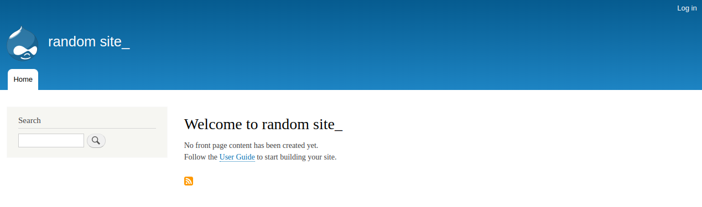

# Task:
________

1. Build a basic compose file for a Drupal content managment system website. Refer DockerHub.
2. Use the drupal image along with the postgres image. (official images recommended)
3. Use ports to expose Drupal on 8080 so you can do local host: 8080 
    1. Be sure to set POSTGRES_PASSWORD for postgres. 
    2. Walk through Drupal setup bia browser. 
    3. Tip: Drupal assumes DB is [localhost](http://localhost), but it’s service name
    
    
    
# Assignment: Build a Compose File For a Multi-Container Project

> Goal: Create a compose config for a local Drupal CMS website

[Docker Mastery Lecture](https://www.udemy.com/course/docker-mastery/learn/lecture/6775804)

- This empty directory is where you should create a docker-compose.yml
- Use the `drupal:9.3.13` image along with the `postgres:14.3` image
- 2020 UPDATE: No version needed in compose files! All 2.x and 3.x features supported without version key.
- Use `ports` to expose Drupal on 8080 (or your preferred port for localhost access)
- Be sure to setup the POSTGRES_PASSWORD environment variable on the postgres service
- Walk through the Drupal config steps in browser at `http://localhost:8080`
- Tip: Drupal setup will assume the database runs on localhost, which is incorrect. You'll need to change it to the name of the service you gave to postgres
- Use Docker Hub documentation to figure out the right environment and volume settings
- Extra Credit: Use volumes to store Drupal unique data

<h3>This is the final image:</h3>

