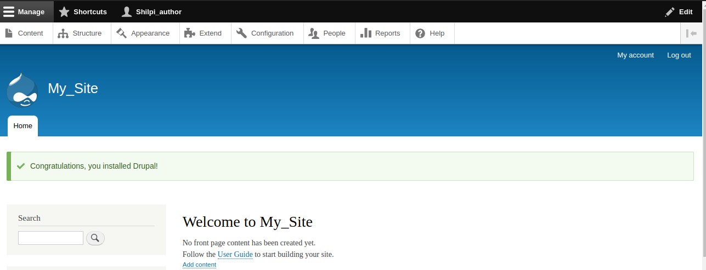

# Task
_________
1. build custom drupal image from the official repo for local testing (we’ll do some stuff to it) . 
2. use the copose file u built in the prev assignment  
3. create a dockerfile, and docker-compose.ym. in dir compose-assignment-2. 
4. use the drupal image along with the postgres image as before. 
5. Use [README.md](http://README.md) in that dir for details.

<h1>The readme file in question: </h1>

# Commands for Terminal: 
- docker compose up
- docker compose down

# Assignment: Compose For Image Building

> Goal: This time imagine you're just wanting to learn Drupal's admin and GUI, or maybe you're a software tester and you need to test a new theme for Drupal. When configured properly, this will let you build a custom image and start everything with `docker-compose up` including storing important db and config data in volumes so the site will remember your changes across Compose restarts.

[Docker Mastery Lecture](https://www.udemy.com/course/docker-mastery/learn/lecture/6775804)

- Use the compose file you created in the last assignment (drupal and postgres) as a starting point.
- Let's pin image version from Docker Hub this time.
It's always a good idea to do that so a new major version doesn't surprise you.

## Dockerfile

- First you need to build a custom Dockerfile in this directory,
`FROM drupal:9.3.13` NOTE: if it fails to build, try the latest 9 branch version with `FROM drupal:9`
- Then RUN apt package manager command to install git: `apt-get update \ && apt-get install -y git`
- Remember to cleanup after your apt install with `rm -rf /var/lib/apt/lists/*` and use `\` and `&&` properly.
You can find examples of them in drupal official image. More on this below under Compose file.
- Then change `WORKDIR /var/www/html/themes`
- Then use git to clone the theme with:
`RUN git clone --branch 8.x-4.x --single-branch --depth 1 https://git.drupalcode.org/project/bootstrap.git`
- Combine that line with this line, as we need to change permissions on files and don't want to
use another image layer to do that (it creates size bloat).
This drupal container runs as www-data user but the build actually runs as root,
so often we have to do things like `chown` to change file owners to the proper user:
`chown -R www-data:www-data bootstrap`. Remember the first line needs a `\` at end
to signify the next line is included in the command, and at start of next line you should have
`&&` to signify "if first command succeeds then also run this command"
- Then, just to be safe, change the working directory back to its default (from drupal image) at `/var/www/html`

## Compose File

- We're going to build a custom image in this compose file for drupal service.
Use Compose file from previous assignment for Drupal to start with, and we'll add to it, as well as change image name.
- Rename image to `custom-drupal` as we want to make a new image based on the official `drupal:9.3.13`.
- We want to build the default Dockerfile in this directory by adding `build: .` to the `drupal` service.
When we add a build + image value to a compose service,
it knows to use the image name to write to in our image cache, rather then pull from Docker Hub.
- For the `postgres:14.3` service, you need the same password as in previous assignment,
but also add a volume for `drupal-data:/var/lib/postgresql/data` so the database will
persist across Compose restarts.

## Start Containers, Configure Drupal

- Start containers like before, configure Drupal web install like before.
- After site comes up, click on `Appearance` in top bar, and notice a new theme called`Bootstrap` is there.
That's the one we added with our custom Dockerfile.
- Click `Install and set as default`.
Then click `Back to site` (in top left) and the site interface should look different.
You've successfully installed and activated a new theme in your own custom image without
installing anything on your host other than Docker!
- If you exit (ctrl-c) and then `docker-compose down` it will delete containers,
but not the volumes, so on next `docker-compose up` everything will be as it was.
- To totally clean up volumes, add `-v` to `down` command.

## BONUS: Use MariaDB rather than Postgres

In newer versions of Drupal, they've begun to prefer MySQL or MariaDB over Postgres. You could try installing it using the [recommendations guide on Drupal.org](https://www.drupal.org/docs/system-requirements/database-server-requirements).

